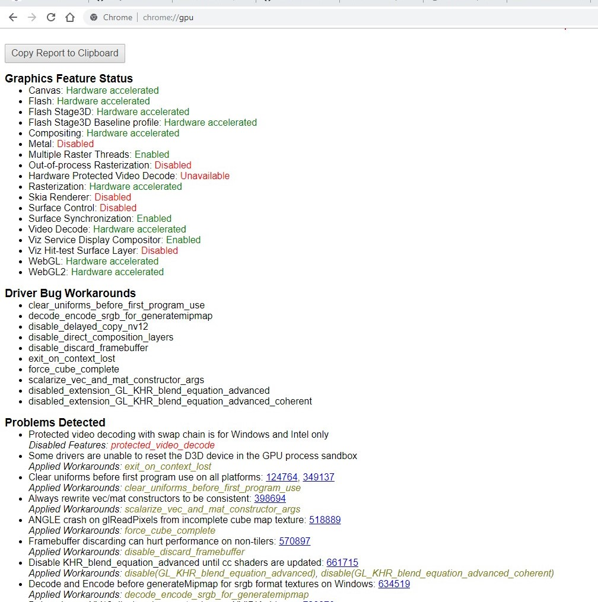
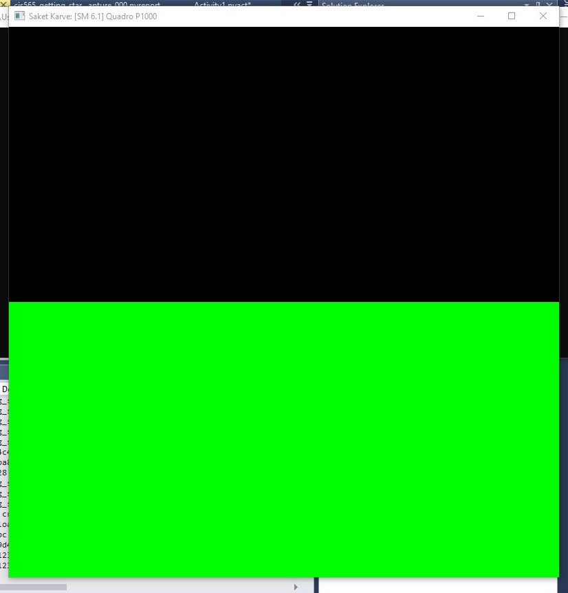
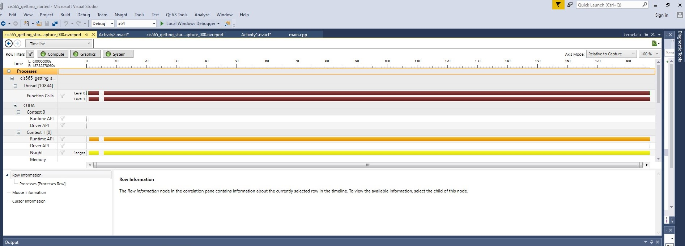
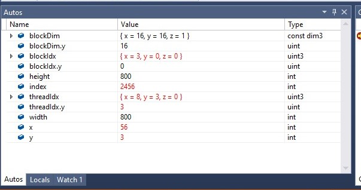
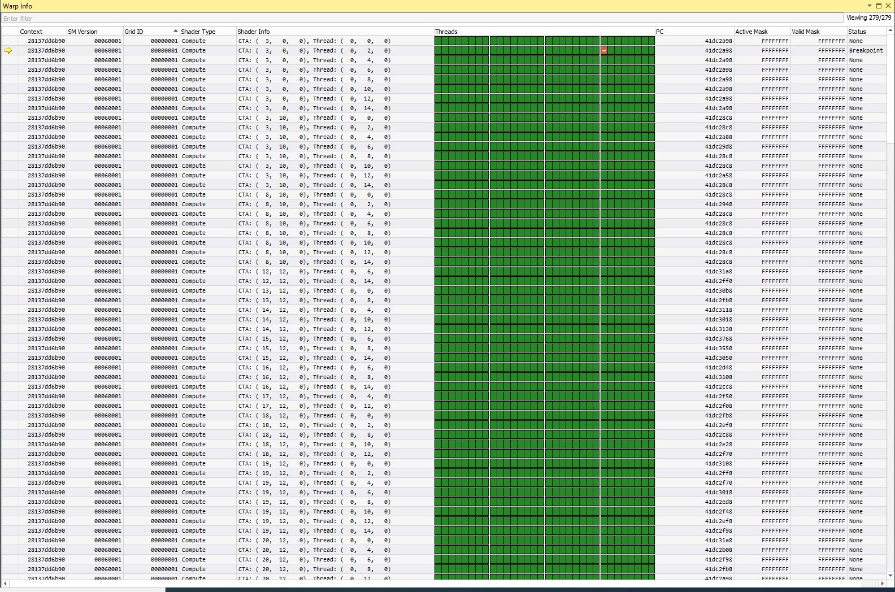

Project 0 Getting Started
====================

**University of Pennsylvania, CIS 565: GPU Programming and Architecture, Project 0**

* Saket Karve
  * [LinkedIn](https://www.linkedin.com/in/saket-karve-43930511b/), [twitter](), etc.
* Tested on:  Windows 10 Education, Intel(R) Core(TM) i7-6700 CPU @ 3.40GHz 16GB, GTX 222 222MB (Moore 100B Lab)

### Screenshots

#### WebGL Support

[PDF](images/chrome_gpu.pdf)

#### Running the modified version of CUDA project

#### Analysis using NSight

#### NSight Debugging
- Autos

- Warp info

Include screenshots, analysis, etc. (Remember, this is public, so don't put
anything here that you don't want to share with the world.)

